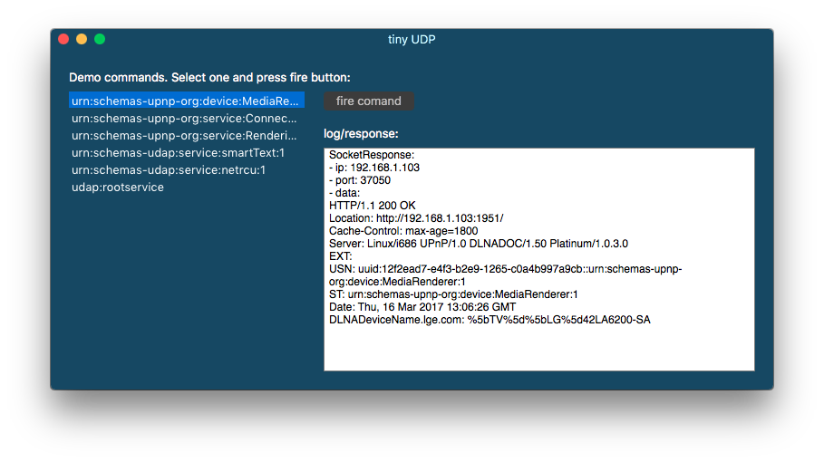

# tinyUDP

**This is a work in progress**

A tiny UDP socket and a simple macOS app for example usage. I'm using it to reach my SmartTV and get it's resources so I can send commands and control it from my mac ;)

